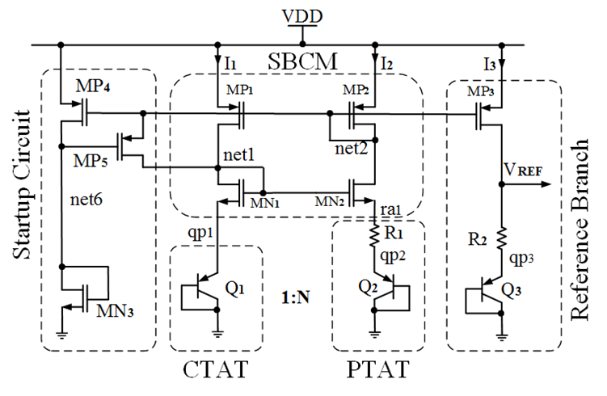

# Bandgap Reference

# Bandgap Voltage Reference using sky130nm PDK
 - [Day 1: Bandgap Design Theory](#Day1)
  * [Introduction to BGR](#Introduction-to-BGR)
  * [BGR Principle](#BGR-Principle)
  * [CTAT Voltage generation circuit](#CTAT-Voltage-generation-circuit)
  * [PTAT Voltage generation circuit](#PTAT-Voltage-generation-circuit)
  * [Self-Biased Current Mirror Circuit](#SelfBiased-Current-Mirror-Circuit)
  * [Reference Branch Circuit](#Reference-Branch-Circuit)
  * [Start-up circuit](#Startup-circuit)
  * [Complete BGR Circuit](#Complete-BGR-Circuit)
  * [Tools Used](#Tools-Used)
  * [Specification](#Specification)
- [Day 2: BGR Labs and post-layout simulations](#Day2)
  * [Pre-Layout Simulation](#PreLayout-Simulation)
  * [CTAT Simulation](#CTAT-Simulation)
  * [PTAT Simulation](#PTAT-Simulation)
  * [BGR using Ideal Opamp](#BGR-using-Ideal-Opamp)
  * [BGR with SBCM](#BGR-with-SBCM)
  * [Layout Design](#Layout-Design)
  * [Block Design](#Block-Design)
  * [Top level design](#Top-level-design)
  * [Author](#Author)
  * [Acknowledgement](#Acknowledgement)


## Day1
Bandgap reference circuit

## Introduction to BGR

## BGR Principle

## CTAT Voltage generation circuit


## PTAT Voltage generation circuit


## SelfBiased Current Mirror Circuit

## Reference Branch Circuit

## Startup circuit

## Complete BGR Circuit

## Tools Used
Ngspice: for simulation of spice files
Magic: for creating layouts for circuits
Netgen: tool for comparing netlists
## Specification
Supply voltage = 1.8V
Temperature: -40 to 125 Deg Cent.
Power Consumption < 60uW
Off current < 2uA
Start-up time < 2us
Tempco. Of Vref < 50 ppm
## Day2


## CTAT Simulation
## CTAT Voltage generation with single BJT
The aim of this simulation is to find the voltage variation across BJT with respect to the temp if use current source of 10uA. The spice netlist which we are going to simulate is,
```
**** ctat voltage generation circuit *****

.lib "/home/ramachandra14519/Desktop/ramachandra_bgr/eda-technology/sky130/models/spice/models/sky130.lib.spice tt"
.include "/home/ramachandra14519/Desktop/ramachandra_bgr/eda-technology/sky130/models/spice/models/sky130_fd_pr__model__pnp.model.spice"

.global vdd gnd
.temp 27

*** bjt definition
xqp1	gnd	gnd	qp1	gnd	sky130_fd_pr__pnp_05v5_W3p40L3p40	m=1

*** supply voltage and current
vsup	vdd	gnd	dc	2
isup	vdd	qp1	dc 	10u
.dc	temp	-40	125	5

*** control statement
.control
run
plot v(qp1)
.endc
.end
```
And to simulate this netlist, type ngspice ctat_voltage_gen.sp. Now we the see the corresponding waveform after the simulation

## CTAT Voltage genration with multiple BJTs
In this simulation, we are going to see calculate voltage across 8 BJTs which are parllely connectd. The spice netlist which we are going to simulate is,
```
**** ctat voltage generation circuit with multiple bjt *****

.lib "/home/ramachandra14519/Desktop/ramachandra_bgr/eda-technology/sky130/models/spice/models/sky130.lib.spice tt"
.include "/home/ramachandra14519/Desktop/ramachandra_bgr/eda-technology/sky130/models/spice/models/sky130_fd_pr__model__pnp.model.spice"

.global vdd gnd
.temp 27

*** bjt definition
xqp1	gnd	gnd	qp1	gnd	sky130_fd_pr__pnp_05v5_W3p40L3p40	m=8

*** supply voltage and current
vsup	vdd	gnd	dc	2
isup	vdd	qp1	dc 	10u
.dc	temp	-40	125	5

*** control statement
.control
run
plot v(qp1)
.endc
.end
```
And to simulate this netlist, type ngspice ctat_voltage_gen_mul_bjt.sp. Now we the see the corresponding waveform after the simulation

## CTAT Voltage generation with different current source values
In this simulation, the main objective is to check the CTAT voltage dependency on current. The spice netlist which we are going to simulate is,
```
**** ctat voltage generation circuit with variable current *****

.lib "/home/ramachandra14519/Desktop/ramachandra_bgr/eda-technology/sky130/models/spice/models/sky130.lib.spice tt"
.include "/home/ramachandra14519/Desktop/ramachandra_bgr/eda-technology/sky130/models/spice/models/sky130_fd_pr__model__pnp.model.spice"


.global vdd gnd
.temp 27

*** bjt definition
xqp1	gnd	gnd	qp1	gnd	sky130_fd_pr__pnp_05v5_W3p40L3p40	m=1

*** supply current
vsup	vdd	gnd	dc	2
isup	vdd	qp1	dc 	10u
.dc	temp	-40	125	5	isup	1.25u	10u	1.25u

*** control statement
.control
run
plot v(qp1)
.endc
.end
```
And to simulate this netlist, type ngspice ctat_voltage_gen_var_current.sp. Now we the see the corresponding waveform after the simulation

## PTAT Simulation
## PTAT Voltage generation with ideal current source
In this simulation, the main objective is to find the voltage difference between the two terminals of the resistance. The spice netlist which we are going to simulate is,
```
**** ptat voltage generation circuit *****

.lib "/home/ramachandra14519/Desktop/ramachandra_bgr/eda-technology/sky130/models/spice/models/sky130.lib.spice tt"
.include "/home/ramachandra14519/Desktop/ramachandra_bgr/eda-technology/sky130/models/spice/models/sky130_fd_pr__model__pnp.model.spice"

.global vdd gnd
.temp 27

	
*** bjt definition
xqp2    gnd     gnd     qp2     vdd     sky130_fd_pr__pnp_05v5_W3p40L3p40       m=8

*** high-poly resistance definition
xra1    ra1     na1     vdd     sky130_fd_pr__res_high_po_1p41     w=1.41  	l=7.8
xra2    na1     na2     vdd     sky130_fd_pr__res_high_po_1p41     w=1.41	l=7.8
xra3    na2     qp2     vdd     sky130_fd_pr__res_high_po_1p41     w=1.41	l=7.8
xra4    na2     qp2     vdd     sky130_fd_pr__res_high_po_1p41     w=1.41	l=7.8

*** supply voltage and current
isup	vdd	ra1	dc	10u
vsup	vdd	gnd	dc 	2
.dc	temp	-40	125	1

*** control statement
.control
run
plot v(ra1) v(qp2) v(ra1)-v(qp2)
.endc
.end
```
And to simulate this netlist, type ngspice ptat_voltage_gen_ideal_current_source.sp. Now we the see the corresponding waveform after the simulation

## PTAT Voltage generation with VCVS

In this simulation, the main objective is to check the amplified PTAT voltage using one VCVS. The spice netlist which we are going to simulate is,
```
**** ptat voltage generation circuit *****

.lib "/home/ramachandra14519/Desktop/ramachandra_bgr/eda-technology/sky130/models/spice/models/sky130.lib.spice tt"
.include "/home/ramachandra14519/Desktop/ramachandra_bgr/eda-technology/sky130/models/spice/models/sky130_fd_pr__model__pnp.model.spice"

.global vdd gnd
.temp 27

*** vcvs definition
e1	net2	gnd	ra1	qp1	gain=1000
xmp1    q1	net2   	vdd	vdd     sky130_fd_pr__pfet_01v8_lvt     l=2     w=5     m=4
xmp2    q2    	net2    vdd     vdd     sky130_fd_pr__pfet_01v8_lvt     l=2     w=5     m=4
	
*** bjt definition
xqp1	gnd	gnd	qp1	vdd	sky130_fd_pr__pnp_05v5_W3p40L3p40	m=1
xqp2    gnd     gnd     qp2     vdd     sky130_fd_pr__pnp_05v5_W3p40L3p40       m=8

*** high-poly resistance definition
xra1    ra1     na1     vdd     sky130_fd_pr__res_high_po_1p41     w=1.41  	l=7.8
xra2    na1     na2     vdd     sky130_fd_pr__res_high_po_1p41     w=1.41	l=7.8
xra3    na2     qp2     vdd     sky130_fd_pr__res_high_po_1p41     w=1.41	l=7.8
xra4    na2     qp2     vdd     sky130_fd_pr__res_high_po_1p41     w=1.41	l=7.8

*** voltage sources for current measurement
vid1	q1	qp1	dc	0
vid2	q2	ra1	dc	0

*** supply voltage
vsup	vdd	gnd	dc 	2
.dc	temp	-40	125	5

*** control statement
.control
run
plot v(qp1) v(ra1) v(qp2) v(net2)
plot vid1#branch vid2#branch
.endc
.end
```
And to simulate this netlist, type ngspice ptat_voltage_gen.sp. Now we the see the corresponding waveform after the simulation

## Resistance tempco.
The voltage across the resistor also increases with increase in the temperature, which makes the resistor similar to PTAT. The main objective of this simulation is to check the tempco. of resistor using ideal current source of 10uA. The spice netlist which we are going to simulate is,
```
**** ctat voltage generation circuit *****

.lib "/home/ramachandra14519/Desktop/ramachandra_bgr/eda-technology/sky130/models/spice/models/sky130.lib.spice tt"
.include "/home/ramachandra14519/Desktop/ramachandra_bgr/eda-technology/sky130/models/spice/models/sky130_fd_pr__model__pnp.model.spice"

.global vdd gnd
.temp 27

*** resistor definition
xra1    ra1     na1     vdd     sky130_fd_pr__res_high_po_1p41     w=1.41  l=7.8
xra2    na1     na2     vdd     sky130_fd_pr__res_high_po_1p41     w=1.41  l=7.8
xra3    na2     qp2     vdd     sky130_fd_pr__res_high_po_1p41     w=1.41  l=7.8
xra4    na2     qp2     vdd     sky130_fd_pr__res_high_po_1p41     w=1.41  l=7.8

*** supply current
vsup	vdd	gnd	dc	2
vid     qp2     gnd     dc      0
isup	gnd	ra1	dc 	10u
.dc	temp	-40	125	1	

*** control statement
.control
run
plot v(ra1) 
plot v(ra1)/vid#branch
.endc
.end
```
And to simulate this netlist, type ngspice res_tempco.sp. Now we the see the corresponding waveform after the simulation

To find the PTAT voltages across the resistance for different current values from the following curve we have to simulate the netlist res_tempco_var_current.sp
```
**** RES tempco circuit *****

.lib "/home/ramachandra14519/Desktop/ramachandra_bgr/eda-technology/sky130/models/spice/models/sky130.lib.spice tt"
.include "/home/ramachandra14519/Desktop/ramachandra_bgr/eda-technology/sky130/models/spice/models/sky130_fd_pr__model__pnp.model.spice"

.global vdd gnd
.temp 27

*** resistor definition
xra1    ra1     na1     vdd     sky130_fd_pr__res_high_po_1p41     w=1.41  l=7.8
xra2    na1     na2     vdd     sky130_fd_pr__res_high_po_1p41     w=1.41  l=7.8
xra3    na2     qp2     vdd     sky130_fd_pr__res_high_po_1p41     w=1.41  l=7.8
xra4    na2     qp2     vdd     sky130_fd_pr__res_high_po_1p41     w=1.41  l=7.8

*** supply current
vsup	vdd	gnd	dc	2
vid     qp2     gnd     dc      0
isup	gnd	ra1	dc 	10u
.dc	temp	-40	125	1	isup	1.25u	10u	1.25u

*** control statement
.control
run
plot v(ra1) 
plot v(ra1)/vid#branch
.endc
.end
```

## BGR using Ideal Opamp
To simulate the BGR behaviour using one VCVS as an ideal OpAmp, we have to simulate the netlist bgr_using_ideal_opamp.sp
```
**** bgr using ideal opamp (vcvs) *****

.lib "/home/ramachandra14519/Desktop/ramachandra_bgr/eda-technology/sky130/models/spice/models/sky130.lib.spice tt"
.include "/home/ramachandra14519/Desktop/ramachandra_bgr/eda-technology/sky130/models/spice/models/sky130_fd_pr__model__pnp.model.spice"

.global vdd gnd
.temp 27

*** vcvs definition
e1 net2 gnd ra1 qp1 gain=1000


xmp1    qp1	net2   	vdd	vdd     sky130_fd_pr__pfet_01v8_lvt     l=2     w=5     m=4
xmp2    ra1 	net2   	vdd     vdd     sky130_fd_pr__pfet_01v8_lvt     l=2     w=5     m=4
xmp3    ref	net2    vdd     vdd     sky130_fd_pr__pfet_01v8_lvt     l=2     w=5     m=4
	
*** bjt definition
xqp1	gnd	gnd	qp1	gnd	sky130_fd_pr__pnp_05v5_W3p40L3p40	m=1
xqp2    gnd     gnd     qp2     gnd     sky130_fd_pr__pnp_05v5_W3p40L3p40       m=8
xqp3    gnd     gnd     qp3     gnd     sky130_fd_pr__pnp_05v5_W3p40L3p40       m=1

*** high-poly resistance definition
xra1    ra1     na1     vdd     sky130_fd_pr__res_high_po_1p41     w=1.41  	l=7.8
xra2    na1     na2     vdd     sky130_fd_pr__res_high_po_1p41     w=1.41	l=7.8
xra3    na2     qp2     vdd     sky130_fd_pr__res_high_po_1p41     w=1.41	l=7.8
xra4    na2     qp2     vdd     sky130_fd_pr__res_high_po_1p41     w=1.41	l=7.8

xrb1    ref     nb1     vdd     sky130_fd_pr__res_high_po_1p41     w=1.41	l=7.8
xrb2    nb1     nb2     vdd     sky130_fd_pr__res_high_po_1p41     w=1.41  	l=7.8
xrb3    nb2     nb3     vdd     sky130_fd_pr__res_high_po_1p41     w=1.41  	l=7.8
xrb4    nb3     nb4     vdd     sky130_fd_pr__res_high_po_1p41     w=1.41  	l=7.8
xrb5    nb4     nb5     vdd     sky130_fd_pr__res_high_po_1p41     w=1.41  	l=7.8
xrb6    nb5     nb6     vdd     sky130_fd_pr__res_high_po_1p41     w=1.41  	l=7.8
xrb7    nb6     nb7     vdd     sky130_fd_pr__res_high_po_1p41     w=1.41  	l=7.8
xrb8    nb7     nb8     vdd     sky130_fd_pr__res_high_po_1p41     w=1.41  	l=7.8
xrb9    nb8     nb9     vdd     sky130_fd_pr__res_high_po_1p41     w=1.41  	l=7.8
xrb10   nb9     nb10    vdd     sky130_fd_pr__res_high_po_1p41     w=1.41  	l=7.8
xrb11   nb10    nb11    vdd     sky130_fd_pr__res_high_po_1p41     w=1.41  	l=7.8
xrb12   nb11    nb12    vdd     sky130_fd_pr__res_high_po_1p41     w=1.41  	l=7.8
xrb13   nb12    nb13    vdd     sky130_fd_pr__res_high_po_1p41     w=1.41  	l=7.8
xrb14   nb13    nb14    vdd     sky130_fd_pr__res_high_po_1p41     w=1.41  	l=7.8
xrb15   nb14    nb15    vdd     sky130_fd_pr__res_high_po_1p41     w=1.41  	l=7.8
xrb16   nb15    nb16    vdd     sky130_fd_pr__res_high_po_1p41     w=1.41 	l=7.8
xrb17   nb16    nb17    vdd     sky130_fd_pr__res_high_po_1p41     w=1.41   	l=7.8
xrb18   nb17    nb18    vdd     sky130_fd_pr__res_high_po_1p41     w=1.41   	l=7.8
xrb19   nb18    nb19    vdd     sky130_fd_pr__res_high_po_1p41     w=1.41   	l=7.8
xrb20   nb19    nb20    vdd     sky130_fd_pr__res_high_po_1p41     w=1.41  	 l=7.8
xrb21   nb20    nb21    vdd     sky130_fd_pr__res_high_po_1p41     w=1.41   	l=7.8
xrb22   nb21    nb22    vdd     sky130_fd_pr__res_high_po_1p41     w=1.41  	 l=7.8
xrb23   nb22    qp3     vdd     sky130_fd_pr__res_high_po_1p41     w=1.41  	l=7.8
xrb24   nb22    qp3     vdd     sky130_fd_pr__res_high_po_1p41     w=1.41  	l=7.8

*** voltage source for current measurement

*** supply voltage
vsup    vdd     gnd     dc      2
*.dc    vsup    0       3.3     0.3.3

.dc	temp    -40     125     5

*vsup    vdd     gnd     pulse   0       2       10n     1u      1u      1m      100u
*.tran   5n      10u

.control
RUN
plot v(vdd) v(qp1) v(ra1) v(qp2) v(ref) v(qp3)
plot v(ref)


.endc
.end
```

## BGR with SBCM
Let's replace the ideal Op-Amp with self-biased current mirror which is our proposed design and observe. The expected output is of that which in case of ideal OpAmp based BGR. Now lets check Behaviour of the circuit in TT corner using the spice netlist bgr_lvt_rpolyh_3p40.sp
```
**** bandgap reference circuit using self-biase current mirror *****

.lib "/home/ramachandra14519/Desktop/ramachandra_bgr/eda-technology/sky130/models/spice/models/sky130.lib.spice tt"
.include "/home/ramachandra14519/Desktop/ramachandra_bgr/eda-technology/sky130/models/spice/models/sky130_fd_pr__model__pnp.model.spice"

.global vdd gnd
.temp 27

*** circuit definition ***

*** mosfet definitions self-biased current mirror and output branch
xmp1	net1	net2	vdd	vdd	sky130_fd_pr__pfet_01v8_lvt	l=2	w=5	m=4
xmp2    net2    net2    vdd     vdd     sky130_fd_pr__pfet_01v8_lvt     l=2     w=5    	m=4
xmp3    net3    net2    vdd     vdd     sky130_fd_pr__pfet_01v8_lvt     l=2     w=5     m=4
xmn1    net1    net1    q1      gnd     sky130_fd_pr__nfet_01v8_lvt     l=1     w=5     m=8
xmn2    net2    net1    q2      gnd     sky130_fd_pr__nfet_01v8_lvt     l=1     w=5     m=8

*** start-upcircuit
xmp4    net4    net2    vdd     vdd     sky130_fd_pr__pfet_01v8_lvt     l=2     w=5     m=1
xmp5    net5    net2    net4    vdd     sky130_fd_pr__pfet_01v8_lvt     l=2     w=5     m=1
xmp6    net7    net6    net2    vdd     sky130_fd_pr__pfet_01v8_lvt     l=2     w=5     m=2
xmn3    net6    net6    net8    gnd     sky130_fd_pr__nfet_01v8_lvt     l=7     w=1     m=1
xmn4    net8    net8    gnd     gnd     sky130_fd_pr__nfet_01v8_lvt     l=7     w=1     m=1

*** bjt definition
xqp1	gnd	gnd	qp1	vdd	sky130_fd_pr__pnp_05v5_W3p40L3p40	m=1
xqp2    gnd     gnd     qp2     vdd     sky130_fd_pr__pnp_05v5_W3p40L3p40       m=8
xqp3    gnd     gnd     qp3     vdd     sky130_fd_pr__pnp_05v5_W3p40L3p40       m=1

*** high-poly resistance definition
xra1	ra1	na1	vdd	sky130_fd_pr__res_high_po_1p41     w=1.41  l=7.8
xra2	na1     na2     vdd     sky130_fd_pr__res_high_po_1p41     w=1.41  l=7.8
xra3    na2     qp2     vdd     sky130_fd_pr__res_high_po_1p41     w=1.41  l=7.8
xra4    na2     qp2     vdd     sky130_fd_pr__res_high_po_1p41     w=1.41  l=7.8

xrb1    vref    nb1     vdd     sky130_fd_pr__res_high_po_1p41     w=1.41  l=7.8
xrb2    nb1     nb2     vdd     sky130_fd_pr__res_high_po_1p41     w=1.41  l=7.8
xrb3    nb2     nb3     vdd     sky130_fd_pr__res_high_po_1p41     w=1.41  l=7.8
xrb4    nb3     nb4     vdd     sky130_fd_pr__res_high_po_1p41     w=1.41  l=7.8
xrb5    nb4     nb5     vdd     sky130_fd_pr__res_high_po_1p41     w=1.41  l=7.8
xrb6    nb5     nb6     vdd     sky130_fd_pr__res_high_po_1p41     w=1.41  l=7.8
xrb7    nb6     nb7     vdd     sky130_fd_pr__res_high_po_1p41     w=1.41  l=7.8
xrb8    nb7     nb8     vdd     sky130_fd_pr__res_high_po_1p41     w=1.41  l=7.8
xrb9    nb8     nb9     vdd     sky130_fd_pr__res_high_po_1p41     w=1.41  l=7.8
xrb10   nb9     nb10    vdd     sky130_fd_pr__res_high_po_1p41     w=1.41  l=7.8
xrb11   nb10    nb11    vdd     sky130_fd_pr__res_high_po_1p41     w=1.41  l=7.8
xrb12   nb11    nb12    vdd     sky130_fd_pr__res_high_po_1p41     w=1.41  l=7.8
xrb13   nb12    nb13    vdd     sky130_fd_pr__res_high_po_1p41     w=1.41  l=7.8
xrb14   nb13    nb14    vdd     sky130_fd_pr__res_high_po_1p41     w=1.41  l=7.8
xrb15   nb14    nb15    vdd     sky130_fd_pr__res_high_po_1p41     w=1.41  l=7.8
xrb16   nb15    nb16    vdd     sky130_fd_pr__res_high_po_1p41     w=1.41  l=7.8
xrb17   nb16    qp3   	vdd     sky130_fd_pr__res_high_po_1p41     w=1.41  l=7.8
xrb18   nb16    qp3     vdd     sky130_fd_pr__res_high_po_1p41     w=1.41  l=7.8

*** voltage source for current measurement
vid1	q1	qp1	dc	0
vid2    q2      ra1     dc      0
vid3    net3    vref    dc      0
vid4    net7	net1	dc	0
vid5	net5	net6	dc	0

*** supply voltage
vsup	vdd	gnd	dc 	2
*.dc	vsup	0	3.3	0.3.3
.dc	temp	-40	125	5

*vsup	vdd	gnd	pulse	0	2	10n	1u	1u	1m	100u
*.tran	5n	10u

.control
run

plot v(vref)

.endc
.end
```

## Layout Design
The Layout Design for the sub circuits are done magic tool. The invoke the magic tool for new design, the command to type is,
```
magic -T <technology_file_name.tech> <layout.mag>
```
## Basic Cell Design
## Design of NFET
In our design we have used two different size nfets:

W=5 L=1


## Design of PFET
W=5 L=2

## Design of Resistor
poly resistors of W=1.41 L=7.8

## Design of PNP (BJT)


## Block Design
## Design of NFETs

## Design of PFETs

## Design of RESBANK

## Design of PNP10

## Design of STARTERNFET

## Top level design

## Author
## Acknowledgement

It is a temperature dependent voltage reference circuit.

It produce constant voltage regardless of  variation in power supply,temperature ,and loadin circuit.

Challenges: 

1. A battery is unsuitable for use as a reference voltage source as voltage drop after a period of  time.

2. A Voltage reference IC used buried Zener Diode:discrete design require extra components and filtering circuit for frequency to extract thermal noise. 
Low voltage zener diode not available

3. Power supply is not suitable:it provide noisy output.


Solution:

Band Gap reference can be integrated in bulk using MOSFET,BJT.

Applications of BGR

1. Analog to Digital converter

2. Digitalto Analog converter

3. DC to Dc bulk converter

4. Low Dropout regulator

Basic Principal of BGR

It is the combination of CTAT to PTAT voltage generator 


Types of BGR

Architechture wise :
1. Using self- bias corrent mirror,
2. Using Op-amp


Application wise : 
1. Low voltage BGR,
2. High -PSRRand low noise ,
3. Low power,
4. curvature compensated


Advantages :Easy to design,Simple topology,stable.

Limitation : Low power supply rejection ratio, Startup circuit required, Cascode design is needed to reduce the PSRR

Construction OF BGR:
Components
1. CTAT voltage generation circuit :(complementry to absolute temperature)


The CTAT Voltage generation circuit consist of a BJT connected as a diode


a. if no. of PNP transistor =1

b. if no. of parallel connected PNP Transistor =8

c. if variable current source is applied


2. PTAT Voltage generation circuit 

The PTAT Voltgae generation circuit consist of N BJTs connected with a series resistance.

3. Startup circuit (NA)

4. Reference branch circuit 


## Tools and PDK setup

the design and simulation of the BGR circuit is performed using following Tools
Spice netlist simulation - Ngspice

## Design and Pre-layout Simulation

Design Requirements
Color             | Hex                                                                |
| ----------------- | ------------------------------------------------------------------ |
| Supply voltage | 2V|
| Temperature | -40 to 125 Deg Cent. |
|  Power Consumption | < 60uW |
|Tempco. Of Vref| <50ppm|

     
Device Data Sheet

1. MOSFET

Parameter  	    NFET 	/                            PFET

Type 	         LVT 	                            

Voltage     	1.8V 	                            

Vt0 	        ~0.4V 	                            ~-0.6V

Model 	:    sky130_fd_pr__nfet_01v8_lvt 	/sky130_fd_pr__pfet_01v8_lvt

2. BJT (PNP)

Parameter :	PNP

Current Rating 	:1uA-10uA/um2

Beta 	:~12

Vt0 	:11.56 um2

Model :	sky130_fd_pr__pnp_05v5_W3p40L3p40


3. RESISTOR (RPOLYH)

Parameter 	RPOLYH

Sheet Resistance 	~350 Ohm

Tempco. 	2.5 Ohm/Deg Cent

Bin Width 	0.35u, 0.69u, 1.41u, 5.37u

Model 	sky130_fd_pr__res_high_po


## BGR Design
Here we are showing simulation of CTAT and BGR

CTAT Simulation

1. CTAT Voltage generation with single BJT


2. CTAT Voltage generation with multiple BJT

## Screenshots


3. CTAT Voltage generation with different current source values

## Screenshots


BGR Simulation

CTAT voltage +PTAT voltage = Vref


## Conclusion
We can find that the Vref = Vctat+Vptat


